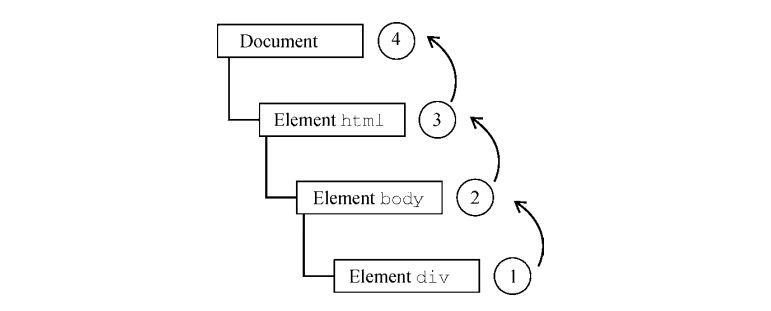
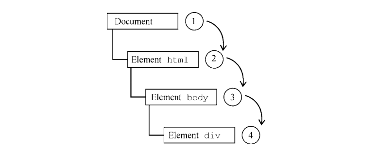

> 微信公众号：**<font color='#f85f48'>[大前端驿站]</font>**
关注大前端驿站。问题或建议，请公众号留言。

#### <font color='#f85f48'>一、事件冒泡和事件捕获</font>
```
<!DOCTYPE html> 
<html>  
<body> 
 <div id="myDiv">点击</div> 
</body> 
</html>
```
`事件冒泡` 从最具体的元素（文档树中最深的节点）开始触发，然后向上传播至没有那么具体的元素（文档），上述代码中点击\<div\>元素，最先触发click事件，然后，click 事件沿 DOM 树一路向上，在经过的每个节点上依次触发，直至到达 document 对象

`事件捕获` 最不具体的节点应该最先收到事件，而最具体的节点应该最后收到事件。事件捕获实际上是为了在事件到达最终目标前拦截事件，上述代码中点击\<div\>元素，最先到达document元素，最后达到\<div\>元素


#### <font color='#f85f48'>二、事件处理程序</font>
> 事件意味着用户或浏览器执行的某种动作。比如，单击（click）、加载（load）、鼠标悬停（mouseover）。为响应事件而调用的函数被称为事件处理程序（或事件监听器）
```
<form method="post"> 
 <input type="text" name="username" value=""> 
 <input type="button" value="Echo Username" 
 onclick="console.log(username.value)"> 
</form>
```
***事件处理程序的代码就可以不必引用表单元素，而直接访问同一表单中的其他成员了***
上述例子中，点击按钮会显示出文本框中包含的文本，注意，事件处理程序中的代码直接引用了username

```
<input type="button" value="Click Me" 
  onclick="try{showMessage();}catch(ex) {}">
```
***为防止在函数定义前触发事件处理程序，通常事件处理程序会封装在try/catch块中，以便在这种情况下静默失败***

##### 赋值和移除 #####
* **DOM2事件处理程序**
赋值addEventListener()和移除removeEventListener()都接收3个参数：事件名、事件处理函数和一个布尔值（true表示在捕获阶段调用事件处理程序，false表示在冒泡阶段调用事件处理程序）
> ***DOM2事件处理程序的主要优势是可以为同一个事件添加多个事件处理程序***
```
let btn = document.getElementById("myBtn"); 
btn.addEventListener("click", () => { 
 console.log(this.id); // 点击按钮先打印元素ID
}, false); 
btn.addEventListener("click", () => { 
 console.log("Hello world!"); // 然后显示消息Hello world!
}, false);
```
> ***需要特别注意的是，使用addEventListener()添加的匿名函数无法移除***
```
// 匿名函数事件程序无法移除
let btn = document.getElementById("myBtn"); 
btn.addEventListener("click", () => { 
 console.log(this.id); 
 }, false); 
// 其他代码
btn.removeEventListener("click", function() { // 没有效果！
 console.log(this.id); 
}, false);
```

```
// 建议以下形式抽取一个公共处理函数
let btn = document.getElementById("myBtn"); 
let handler = function() { 
 console.log(this.id); 
}; 
btn.addEventListener("click", handler, false); 
// 其他代码
btn.removeEventListener("click", handler, false); // 有效果！
```
* **IE事件处理程序**
IE 实现了与 DOM 类似的方法，即 ***attachEvent()和 detachEvent()*** 。这两个方法接收两个同样的参数：事件处理程序的名字和事件处理函数
> ***与DOM2相同：使用 DOM 方法类似，作为事件处理程序添加的匿名函数也无法移除***
> ***与DOM2不同：同一事件添加多个事件处理程序时，以添加的顺序反向触发***

#### <font color='#f85f48'>三、内存与性能</font>
>  ***JavaScript 中，页面中事件处理程序的数量与页面整体性能直接相关***
> * 每个函数都是对象，都占用内存空间，对象越多，性能越差
> * 指定事件处理程序所需访问DOM的次数会造成整个页面交互的延迟
###### 事件委托
当我们页面中的 ***处理程序过多时*** ，可以采用的解决方案是使用 ***事件委托***
我们可以利用事件冒泡的特性，只使用一个事件处理程序来管理一个类型的事件
```
<!--优化前-->
<ul id="myLinks"> 
 <li id="goSomewhere">Go somewhere</li> 
 <li id="doSomething">Do something</li> 
 <li id="sayHi">Say hi</li> 
</ul>
<script>
let item1 = document.getElementById("goSomewhere"); 
let item2 = document.getElementById("doSomething"); 
let item3 = document.getElementById("sayHi"); 
item1.addEventListener("click", (event) => { 
 location.href = "http:// www.wrox.com"; 
}); 
item2.addEventListener("click", (event) => { 
 document.title = "I changed the document's title"; 
}); 
item3.addEventListener("click", (event) => { 
 console.log("hi"); 
});
</script>
```
```
<!--优化后-->
let list = document.getElementById("myLinks"); 
list.addEventListener("click", (event) => { 
 let target = event.target; 
 switch(target.id) { 
 case "doSomething": 
 document.title = "I changed the document's title"; 
 break; 
 case "goSomewhere": 
 location.href = "http:// www.wrox.com"; 
 break; 
 case "sayHi": 
 console.log("hi"); 
 break; 
 } 
});
```
> ***只给document添加一个事件处理程序，有如下优点***
> * 任何时候都可以给document添加事件处理程序（不用等待DOMContentLoaded或load事件）
> * 只指定一个事件处理程序既可以节省DOM引用，也可以节省时间
> * 减少整个页面所需的内存，提升整体性能

###### 删除事件处理程序

> ***<font color='#f85f48'>浏览器代码与js代码中通过事件处理程序建立了的联系越多，将导致页面性能越差</font>***
***<font color='#f85f48'>所以我们还应该及时删除不同的事件处理程序***</font>
```
<div id="myDiv"> 
 <input type="button" value="Click Me" id="myBtn"> 
</div> 
<script type="text/javascript"> 
 let btn = document.getElementById("myBtn"); 
 btn.onclick = function() { 
 // 执行操作
 btn.onclick = null; // 删除事件处理程序
 document.getElementById("myDiv").innerHTML = "Processing..."; 
 }; 
</script>
```
> ***<font color='#f85f48'>如果知道某个元素会被删除，那么最好在删除它之前手工删除它的事件处理程序</font>***


