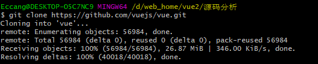
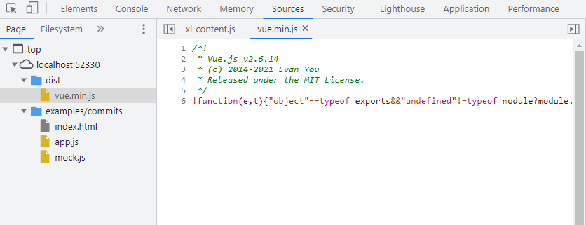
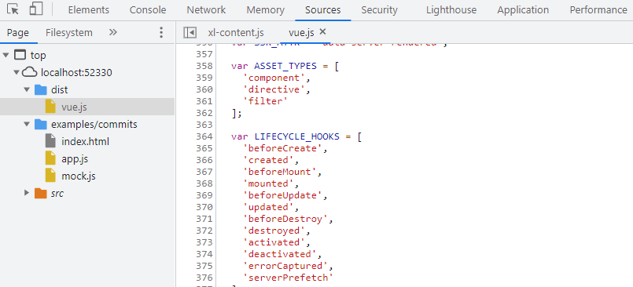
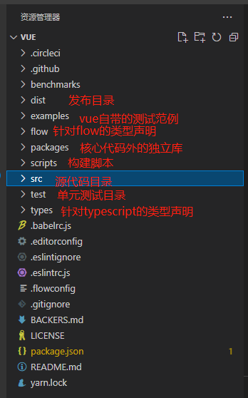
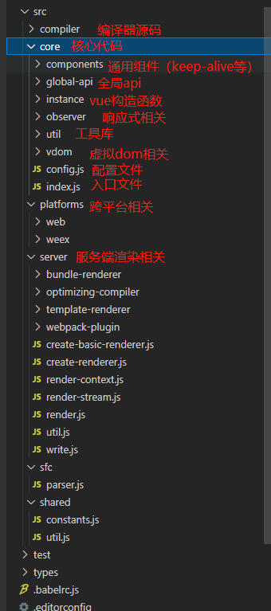

Vue是当今最火的前端框架之一，是一套优秀的前端渐进式框架，它的简单易用性的特点也是众多前端工程师选择的原因。但是想要在众多Vue工程师中脱颖而出，其原理是必须要掌握的，接下来我们一起通过源码分析的角度来学习vue2的一些原理知识。

### 调试环境搭建
___<font size=2 color=green>获取vue</font>___
掌握学习的方法很重要，我们先将vue2的源代码clone下来，然后看看部分重要的源码目录。

项目地址：`https://github.com/vuejs/vue`
git 执行：`git clone https://github.com/vuejs/vue.git`

当前版本："2.6.14"

___<font size=2 color=green>安装依赖</font>___
```
npm i
```
安装到phantom.js时如果特别慢，这时可以提前终止
___<font size=2 color=green>安装rollup</font>___
```
npm i rollup -g
```
___<font size=2 color=green>修改package.json中的dev脚本，添加sourcemap</font>___
```
"dev": "rollup -w -c scripts/config.js --sourcemap --environment TARGET:web- full-dev",
```
___<font size=2 color=green>执行开发命令构建vue.js</font>___
```
npm run dev
```
注意目录不要有中文，不然构建可能会出现报错
构建完成后dist目录中会生成重新构建好的sourcemap的vue.js
___<font size=2 color=green>修改examples/commit/index.html</font>___
```
<!-- <script src="../../dist/vue.min.js"></script> -->
    <script src="../../dist/vue.js"></script>
```
打开index.html，我们可以看到sourcemap的调试便利之处

vue.js可以断点调试代码



> <br>术语解释：
> + runtime: 仅包含运行时，不包含编辑器
> + common: cjs规范，用于webpack1
> + esm: ES模块，用于webpack2
> + umd: 兼容cjs和amd，用于浏览器
> <br>

### 目录结构
vue2源码目录，我们重点关注源代码目录

源代码子目录


### 入口
我们执行执行package.json中的dev脚本，分析脚本知道从scripts/config.js中找到目标环境为web-full-dev处123行
```
// Runtime+compiler development build (Browser)
'web-full-dev': {
  entry: resolve('web/entry-runtime-with-compiler.js'), // 入口
  dest: resolve('dist/vue.js'), // 目标文件
  format: 'umd', // 输出文件的代码规范
  env: 'development',
  alias: { he: './entity-decoder' },
  banner
},
```
此处我们可以看到入口文件是web/entry-runtime-with-compiler.js，但是并没有找到web目录，这是我们可以想到大概是设置了别名，然后确实在scripts/alias.js中找到了
```
 web: resolve('src/platforms/web'),
```
然后我们定位到了入口文件src/platforms/web/entry-runtime-with-compiler.js

### 整体流程
我们从入口文件一步步推导它引入了哪些文件，看看这些文件都做了哪些工作
___<font size=2 color=green>platforms/web/entry-runtime-with-compiler.js</font>___
主要作用：扩展默认的$mount方法，处理template或者el选项
```
import Vue from './runtime/index'
...
const mount = Vue.prototype.$mount
...
```
___<font size=2 color=green>platforms/web/runtime/index</font>___
安装web平台特有指令和组件
定义__patch__：补丁函数，执行patching算法进行更新
定义$mount：挂载vue实例到指定宿主元素（获得dom并替换宿主元素）
___<font size=2 color=green>core/index.js</font>___
初始化全局api
```
Vue.set = set
Vue.delete = del
Vue.nextTick = nextTick 
initUse(Vue) // 实现Vue.use函数 
initMixin(Vue) // 实现Vue.mixin函数 
initExtend(Vue) // 实现Vue.extend函数 
initAssetRegisters(Vue) // 注册实现Vue.component/directive/filter
```
___<font size=2 color=green>core/instance/index.js</font>___
定义Vue构造函数
定义Vue实例api
```
function Vue (options) { 
  // 构造函数仅执行了_init 
  this._init(options) 
}
initMixin(Vue) // 实现init函数
stateMixin(Vue) // 状态相关api $data,$props,$set,$delete,$watch 
eventsMixin(Vue) // 事件相关api $on,$once,$off,$emit 
lifecycleMixin(Vue)  // 生命周期api _update,$forceUpdate,$destroy 
renderMixin(Vue)// 渲染api _render,$nextTick
```
___<font size=2 color=green>core/instance/init.js</font>___
创建组件实例，初始化其数据、属性、事件等
```
initLifecycle(vm) // $parent,$root,$children,$refs
initEvents(vm) // 处理父组件传递的事件和回调
initRender(vm) // $slots,$scopedSlots,_c,$createElement
callHook(vm, 'beforeCreate')
initInjections(vm) // 获取注入数据
initState(vm) // 初始化props，methods，data，computed，watch
initProvide(vm) // 提供数据注入
callHook(vm, 'created')
```
___<font size=2 color=green>$mount: mountComponent</font>___
执行挂载，获取vdom并转换为dom

___<font size=2 color=green>new Watcher()</font>___
创建组件渲染watcher

___<font size=2 color=green>updateComponent()</font>___
执行初始化或更新

___<font size=2 color=green>update()</font>___
初始化或更新，将传入vdom转换为dom，初始化时执行的是dom创建操作

___<font size=2 color=green>render(): src\core\instance\render.js</font>___
渲染组件，获取vdom

> <br>Vue初始化的整体流程
> + new Vue()
> + _init()
> + $mount()
> + mountComponent
> + new Watcher()
> + updateComponent()
> + render()
> + _update()
> <br>

