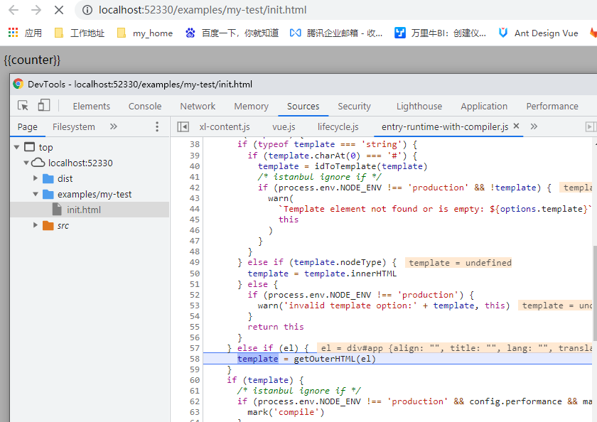

我们在上一章[vue2源码解析(二)](https://mp.weixin.qq.com/s/-WKRZNRgEpYsppnbE5jjFQ)分析了new Vue之后的初始化实例各种属性的过程，今天接着上文继续讲解\$mount，我们可以在源代码文件中看到好像几个地方都定义了$mount方法，这是因为挂载vm的这个过程和平台与构建方式有关系，我们可以看到有web和weex两个平台相关的挂载方式，这里我们只讲web平台相关的代码，我们先分析编译阶段的代码，也就是compile版本。
### $mount
___<font size=2 color=green>platforms/web/entry-runtime-with-compiler.js</font>___
主要作用：扩展默认的$mount方法，处理template或者el选项
```
...
const mount = Vue.prototype.$mount // 缓存runtime-only版本的$mounted
Vue.prototype.$mount = function (
  el?: string | Element,
  hydrating?: boolean
): Component {
  el = el && query(el)
  // 确保vue实例没有定义在html或者body标签上
  if (el === document.body || el === document.documentElement) {
    process.env.NODE_ENV !== 'production' && warn(
      `Do not mount Vue to <html> or <body> - mount to normal elements instead.`
    )
    return this
  }
  const options = this.$options
  // 判断选项中是否有render方法，有则直接调用mount方法，
  // 如果没有render，则需要调用compileToFunctions生成render再调用mount方法
  if (!options.render) {
    let template = options.template
    // 选项中有templat，根据特点进行不同判断处理
    if (template) {
      ...
    }else if (el) { // 有el,通过获取到外层html创建template
      template = getOuterHTML(el)
    }
    ...
    // 调用compileToFunctions生成render
    const { render, staticRenderFns } = compileToFunctions(...)
    options.render = render
    options.staticRenderFns = staticRenderFns
  }
  return mount.call(this, el, hydrating) // 执行runtime-only版本的$mounted
}
```
> </br>vue源码流程中只认识render函数，所以如果我们手动写render函数，那么就直接调用mount.call。反之，vue会将template做为参数，运行时调用compileToFunctions方法，转化为render函数，再去调用mount.call方法。
这里我们得出选项中部分配置的优先级：render > template > el
><br>

然后执行到mount变量缓存的runtime-only版本的$mount方法 - ___<font size=2 color=green>src/platform/web/runtime/index.js</font>___
```
Vue.prototype.$mount = function (
  el?: string | Element,
  hydrating?: boolean
): Component {
  el = el && inBrowser ? query(el) : undefined
  return mountComponent(this, el, hydrating)
}
```
$mount调用了mountComponent函数 - ___<font size=2 color=green>src\core\instance\lifecycle.js</font>___
```
export function mountComponent (
  vm: Component,
  el: ?Element,
  hydrating?: boolean
): Component {
  vm.$el = el
  // 如果此时还是没有render方法，那就要抛出错误提示
  if (!vm.$options.render) {
    ...
  }
  callHook(vm, 'beforeMount')

  // 构建updateComponent方法，更新组件需要用到，很重要
  let updateComponent
  /* istanbul ignore if */
  if (process.env.NODE_ENV !== 'production' && config.performance && mark) {
    updateComponent = () => {
      ...
    }
  } else {
    updateComponent = () => {
      // 执行更新函数
      vm._update(vm._render(), hydrating)
    }
  }

  // new 一个监视器对象Watcher，将构建好的更新函数updateComponent作为传参
  new Watcher(vm, updateComponent, noop, {
    before () {
      if (vm._isMounted && !vm._isDestroyed) {
        callHook(vm, 'beforeUpdate')
      }
    }
  }, true /* isRenderWatcher */)
  hydrating = false

  // 手动挂载实例
  if (vm.$vnode == null) {
    vm._isMounted = true
    callHook(vm, 'mounted')
  }
  return vm
}
```
首先判断render函数是否已经构建好，如果没有则报错。render没有问题则开始构建updateComponent方法，这个方法是每次更新组件时执行的方法。然后new Watch是Vue响应式处理中的依赖收集过程，其原理采用了观察者模式，后续我们会细讲这块响应式原理，这里暂且将他理解为监听变化之后需要执行updateComponent方法来更新组件。最后手动挂载实例。

上一章中我们创建过一个 ___<font size=2 color=green>inint.html</font>___ 的例子，我们可以在$mount出打上一个debugger然后在浏览器中刷新init.html看看\$mount的全部流程。

<font size=2 color=green>$mount在编译过程中构建render的过程</font>


<font size=2 color=green>这个例子中我们设置了el选项将会根据getOuterHTML方法拿到外层的父元素先得到template，然后compileToFunctions得到render</font>


<font size=2 color=green>在runtime-only的$mount中构建updateComponent更新函数</font>


<font size=2 color=green>首次挂载时vm.$vnode不存在需要手动挂载实例</font>


<font size=2 color=green>点击触发onclick事件时直接触发updateComponent方法，而不会再次触发$mount方法</font>


