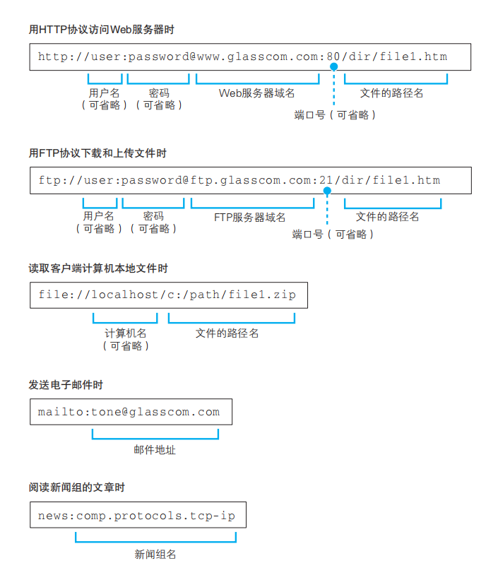
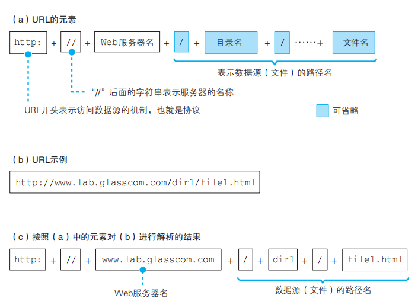
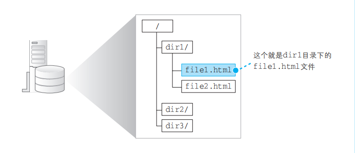
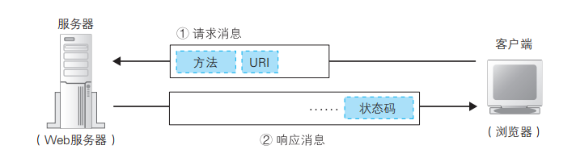
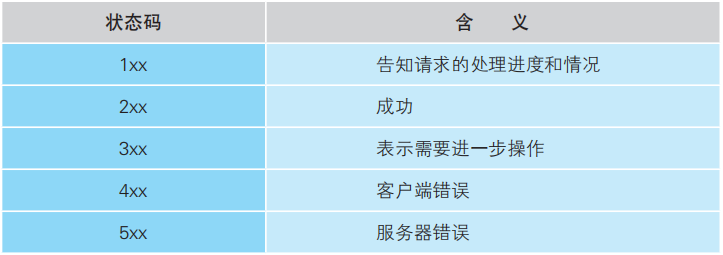

我们在浏览器中输入网址后或者点击网页中的一个链接后，浏览器是如何工作的？
上述问题是面试的一个常规问题，但是在面试中能把它叙述清楚的同学也不多，今天我们就来探讨一下。

#### URL是用来干什么的
我们通常是使用浏览器来访问Web 服务器的，但实际上浏览器并不只有这一个功能，它也可以用来在FTP服务器上下载和上传文件，同时也具备电子邮件客户端的功能。可以说，浏览器是一个具备多种客户端功能的综合性客户端软件，因此它需要一些东西来判断应该使用其中哪种功能来访问相应的数据，而各种不同的URL 就是用来干这个的，比如访问 Web 服务器时用“http：”，而访问 FTP服务器时用“ftp：”。

尽管 URL 有各种不同的写法，但它们有一个共同点，那就是 URL 开头的文字，即“http:”“ftp:”“file:”“mailto:”这部分文字都表示浏览器应当使用的访问方法
#### 浏览器解析URL
浏览器要做的第一步工作就是对 URL 进行解析，从而生成发送给Web服务器的请求消息。

当对 URL进行解析时，首先需要按照图（a）的格式将其中的各个元素拆分出来，例如图（b）中的 URL 会拆分成图（c）的样子。然后，通过拆分出来的这些元素，我们就能够明白 URL 代表的含义

上图（b）中的 URL 表示要访问 www.lab.glasscom.com 这个 Web 服务器上路径名为 /dir/file1.html 的文件，也就是位于 /dir/ 目录 D 下的 file1.html 这个文件

> 注意：服务器上事先设置好文件名省略时要访问的默认文件名。这个设置根据服务器不同而不同，大多数情况下是 index.html 或者 default.htm 之类的文件名。因此，像前面这样省略文件名时，服务器就会访问 /dir/index.html或者 /dir/default.htm。
#### 生成 HTTP 请求消息

HTTP 协议定义了客户端和服务器之间交互的消息内容和步骤
 
对 URL 进行解析之后，浏览器确定了 Web 服务器和文件名，接下来就是根据这些信息来生成 HTTP 请求消息了。实际上，HTTP 消息在格式上是有严格规定的，因此浏览器会按照规定的格式来生成请求消息

#### 向DNS服务器查询Web服务器的IP地址
尽管浏览器能够解析网址并生成 HTTP 消息，但它本身并不具备将消息发送到网络中的功能，因此这一功能需要委托操作系统来实现。在委托操作系统发送消息时，必须要提供的不是通信对象的域名，而是它的IP地址。

我们的计算机上一定有相应的 DNS 客户端，而相当于 DNS 客户端的部分称为 DNS 解析器，或者简称解析器。通过 DNS 查询 IP 地址的操作称为域名解析，因此负责执行解析（resolution）这一操作的就叫解析器（resolver）了

调用解析器后，解析器会向 DNS 服务器发送查询消息，然后 DNS 服务器会返回响应消息。响应消息中包含查询到的 IP 地址，解析器会取出 IP地址，并将其写入浏览器指定的内存地址中。只要运行图 1.11 中的这一行程序，就可以完成前面所有这些工作，我们也就完成了 IP 地址的查询。接下来，浏览器在向 Web 服务器发送消息时，只要从该内存地址取出 IP 地 址，并将它与HTTP 请求消息一起交给操作系统就可以了

#### 发送请求后会收到响应
当我们将上述请求消息发送出去之后，Web 服务器会返回响应消息在响应消息中，第一行的内容为状态码和响应短语，用来表示请求的执行结果是成功还是出错。状态码和响应短语表示的内容一致，但它们的用途不同。状态码是一个数字，它主要用来向程序告知执行的结果；相对地，响应短语则是一段文字，用来向人们告知执行的结果。
###### HTTP 状态码概要

返回响应消息之后，浏览器会将数据提取出来并显示在屏幕上，我们就能够看到网页的样子了。如果网页的内容只有文字，那么到这里就全部处理完毕了，但如果遇到图片相关的标签时，会在屏幕上留出用来显示图片的空间，然后再次访问 Web 服务器，按照标签中指定的文件名向 Web 服务器请求获取相应的图片并显示在预留的空间中。这个步骤和获取网页文件时一样，只要在 URI 部分写上图片的文件名并生成和发送请求消息就可以了。
> 1 条请求消息中只能写 1 个 URI。如果需要获取多个文件，必须对每个文件单独发送 1 条请求。比如 1 个网页中包含 3 张图片，那么获取网页加上获取图片，一共需要向 Web 服务器发送 4 条请求