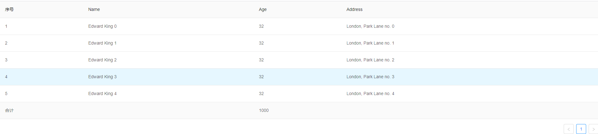
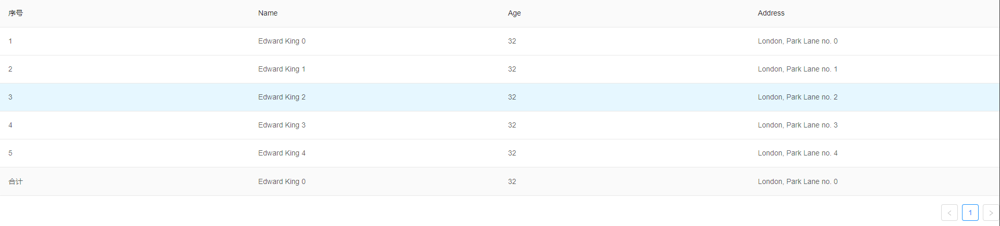

### 背景
最近遇到一个需求，需要在表格的末尾增加合计行，项目用的是Vue2.0搭建的，UI框架使用的是Ant Design Vue，所以第一步是去官网看了一下有没有合适的范例，很遗憾没有。然后开始百度是否有相关的博客文章，发现了一篇React项目相关的文章写得还不错，给予了大致的思路。本着积累知识的原则，我们还是把它用Vue的方式再记录一遍。

### 实现需求
##### 方案一：
合计的数据一般来说后端计算好传给前端，我们需要做的就是将合计的数据增加到表格数据的最后，合计行将会以table的body形式展现出来

<font size=2 color=green>这个比较简单，直接上代码</font>
```
<template>
  <a-table :columns="columns" :data-source="data" />
</template>
<script>
const columns = [
  {
    title: '序号',
    dataIndex: 'key',
  },
  {
    title: 'Name',
    dataIndex: 'name',
  },
  {
    title: 'Age',
    dataIndex: 'age',
  },
  {
    title: 'Address',
    dataIndex: 'address',
  },
];

const data = [];
for (let i = 0; i < 5; i++) {
  data.push({
    key: i+1,
    name: `Edward King ${i}`,
    age: 32,
    address: `London, Park Lane no. ${i}`,
  });
}

// 只需要在数据的末尾push一份合计的数据即可
data.push({
  key: '合计',
  name: '',
  age: 1000,
  address: '',
})

export default {
  data() {
    return {
      data,
      columns,
      selectedRowKeys: [], // Check here to configure the default column
    };
  }
};
</script>
```
<font size=2 color=green>效果如下</font>



##### 方案二：
Ant Design Vue 提供了一个table的footer属性，我们借助这个属性来实现

<font size=2 color=green>构建合计数据</font>
```
computed: {
  footerDataSource () {
    const summary = Object.assign({}, this.data[0])
    for (const attr in summary) {
      summary[attr] = '合计'
      break
    }
    return [summary]
  }
}
```
合计的数据一般是后端提供的，但是需要构建成原表的一行数据相似的数据，我这里直接用了data数据的第一行做为例子，然后将序号列的值改为'合计'，这里要注意footerDataSource也是一个数组类型，因为footer的原理就是加入的另外一个Table

<font size=2 color=green>footer是一个函数或者slot-scope, 函数返回的是另外一个表格</font>
```
handleFooter () {
  return (
    <a-table
      rowKey={Math.random}
      bordered={false}
      pagination={false}
      columns={columns}
      dataSource={this.footerDataSource || []}
      showHeader={false}
    ></a-table>
  )
}
```
这个表格的属性columns和原表相同，footerDataSource是后端传递的合计的数据

<font size=2 color=green>绑定footer属性</font>
```
<template>
  <a-table :columns="columns" :data-source="data" :footer="handleFooter" />
</template>
```
> 注意：footer创建的是一个table，所以会出现跟原表格出现对不齐的状况，这时候我们需要将数据的每一项的width需要固定死，默认width='auto'。
```
const columns = [
  {
    title: '序号',
    dataIndex: 'key',
    width: '25%'
  },
  {
    title: 'Name',
    dataIndex: 'name',
    width: '25%'
  },
  {
    title: 'Age',
    dataIndex: 'age',
    width: '25%'
  },
  {
    title: 'Address',
    dataIndex: 'address',
    width: '25%'
  },
]
```
但是通常table的列数是不固定的，而且业务一般包含增加或者删除列的情况，所以width一般还是需要程序去计算，最好的方法是写在handleFooter方法中
```
handleFooter () {
  // 处理 width 成百分比, 默认 'auto' 会根据text 计算宽度，造成footer对不齐的情况
  const columns = this.columns
  columns.forEach(col => {
    col.width = (100 / columns.length) + '%'
  })
  return (
    <a-table
      rowKey={Math.random}
      bordered={false}
      pagination={false}
      columns={columns}
      dataSource={this.footerDataSource || []}
      showHeader={false}
    ></a-table>
  )
}
```
<font size=2 color=green>footer方式的效果</font>


