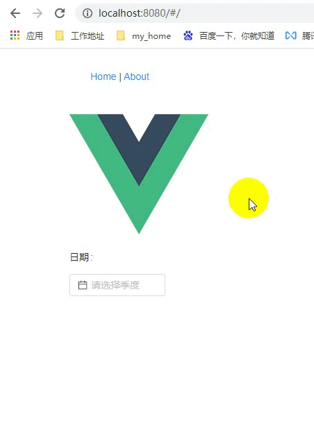

> <font size=2>Vue Router是Vue官方的路由管理器。它和Vue.js深度集成，让构建单页面应用变得易如反掌。</font>

### 使用vue-router
Vue cli创建的vue项目中安装：`vue add router`

核心步骤：
+ 步骤一：创建router.js, 使用vue-router插件
```
import Router from 'vue-router'
Vue.use(Router)
```
+ 步骤二：创建Router实例
```
export default new Router({...})
```
+ 步骤三：main.js中的根组件上添加该实例
```
import router from './router'
new Vue({
  router,
}).$mount('#app')
```
+ 步骤四：在APP.vue中添加路由视图
```
<router-view></router-view>
```
+ 导航
```
<router-link to="/">Home</router-link> |
<router-link to="/about">About</router-link>
```
或者
```
this.$router.push('/')
this.$router.push('/about')
```

### 手写vue-router
###### 实现⼀个插件：创建VueRouter类和install⽅法
___<font size=2 color=green>创建my-vue-router.js</font>___
```
let Vue

class VueRouter {
  constructor(options) {
   this.$options = options // 保存选项
  }
}

// 实现install方法，注册$router
VueRouter.install = function(_Vue) {
  Vue = _Vue // 引用构造函数

  // 使用混入方式是因为调用use的时间非常之早
  Vue.mixin({
    beforeCreate() {
      // 只有根组件拥有router选项
      if(this.$options.router) {
        Vue.prototype.$router = this.$options.router // 挂载$router
      }
    }
  })

  Vue.component('router-link', Link)
  Vue.component('router-view', View)
}

export default VueRouter
```
___<font size=2 color=green>创建my-router-link.js</font>___
```
export default {
  props: {
    to: String,
    required: true
  },
  render(h) {
    //  <a href={'#'+this.to}>{this.$slots.default}</a>
    return h('a', {
      attrs: {
        href: '#' + this.to
      }
    },[
      this.$slots.default
    ])
  }
}
```
___<font size=2 color=green>创建my-router-view.js</font>___
```
export default {
  render(h) {
    return h(null) // 暂时先不渲染任何内容
  }
}
```

###### 监控url变化
___<font size=2 color=green>定义一个响应式的属性current,监听hashonchange事件</font>___
```
import Link from './my-router-link.js'
import View from './my-router-view.js'

let Vue

class VueRouter {
  constructor(options) {
   this.$options = options // 保存选项

   const initial = window.location.hash.slice(1) || '/'
   Vue.util.defineReactive(this, 'current', initial)

   // 监听hashchange事件
   window.addEventListener('hashchange', this.onHashChange.bind(this))
   window.addEventListener('load', this.onHashChange.bind(this))

   // 优化：提前创建路由表，减少循环查询次数
   this.routeMap = {}
   this.$options.routes.forEach(route => {
     this.routeMap[route.path] = route
   })
  }

  onHashChange(){
    this.current = window.location.hash.slice(1)
  }
}

// 实现install方法，注册$router
VueRouter.install = function(_Vue) {
  Vue = _Vue // 引用构造函数

  // 使用混入方式是因为调用use的时间非常之早
  Vue.mixin({
    beforeCreate() {
      // 只有根组件拥有router选项
      if(this.$options.router) {
        Vue.prototype.$router = this.$options.router // 挂载$router
      }
    }
  })

  Vue.component('router-link', Link)
  Vue.component('router-view', View)
}

export default VueRouter
```
___<font size=2 color=green>动态获取对应组件</font>___
```
// my-router-view.js
export default {
  render(h) {
    // 从注册的路由表中动态查询当前的组件
    // let component = null
    // const route = this.$router.$options.routes.find(route => route.path === this.$router.current)
    // if(route) {
    //   component = route.component
    // }
    const {routeMap, current} = this.$router
    const component = routeMap[current] ? routeMap[current].component : null
    return h(component)
  }
}
```
___<font size=2 color=green>更改router/index.js中的router引用</font>___
```
// import VueRouter from 'vue-router'
import VueRouter from '../myRouter/my-vue-router'
```
___<font size=2 color=green>启动项目看效果</font>___

