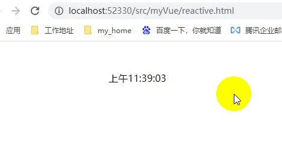
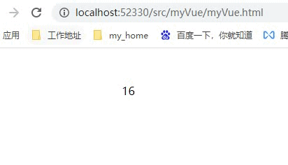

Vue是当今最火的前端框架之一，是一套优秀的前端渐进式框架，它的简单易用性的特点也是众多前端工程师选择的原因。但是想要在众多Vue工程师中脱颖而出，其原理是必须要掌握的，今天我们就来做一套简易的Vue2.0框架。

### 数据响应式原理
所谓数据响应式，简单说就是数据变更能够响应在视图中。Vue2中利用Object.defineProperty()实现变更检测。
___<font size=2 color=green>创建reactive.html</font>___
```
<div id="app"></div>
<script>
  function defineReactive(obj, key, val) {
    Object.defineProperty(obj, key, {
      get: function() {
        console.log(`get ${key}: ${val}`)
        return val
      },

      set: function(v) {
        if(v !== val) {
          console.log(`set ${key}: ${val}`)
          val = v
          update()
        }
      }
    })
  }
  const obj = {}
  defineReactive(obj, 'time', '')
  obj.time = new Date().toLocaleTimeString()
  function update() {
    const app = document.querySelector('#app')
    app.innerText = obj.time
  }
  setInterval(() => {
    obj.time = new Date().toLocaleTimeString()
  }, 1000)

</script>
```
___<font size=2 color=green>浏览器打开reactive.html看效果</font>___

我们可以看到上述代码通过拦截对象的属性实现了vue的响应式效果

> ___原理分析___
> 1. new Vue() ⾸先执⾏初始化，对data执⾏响应化处理，这个过程发⽣在Observer中
> 2. 同时对模板执⾏编译，找到其中动态绑定的数据，从data中获取并初始化视图，这个过程发⽣在
Compile中
> 3. 同时定义⼀个更新函数和Watcher，将来对应数据变化时Watcher会调⽤更新函数
> 4. 由于data的某个key在⼀个视图中可能出现多次，所以每个key都需要⼀个管家Dep来管理多个
Watcher
> 5. 将来data中数据⼀旦发⽣变化，会⾸先找到对应的Dep，通知所有Watcher执⾏更新函数

### 实现简易Vue

> ___实现思路___
> + Vue：框架构造函数
> + Observer：执⾏数据响应化（分辨数据是对象还是数组）
> + Compile：编译模板，初始化视图，收集依赖（更新函数、watcher创建）
> + Watcher：执⾏更新函数（更新dom）
> + Dep：管理多个Watcher，批量更新

___<font size=2 color=green>创建myVue.js</font>___
```
function observe(obj) {
  if (typeof obj !== 'object' || obj == null) {
    return
  }
  new Observer(obj) 
}

function defineReactive(obj, key, val) {}

class Vue {
  constructor(options) {
    this.$options = options;
    this.$data = options.data;
    observe(this.$data)
  }
}

class Observer {
  constructor(value) {
    this.value = value
    this.walk(value);
  }
  walk(obj) {
    Object.keys(obj).forEach(key => {
      defineReactive(obj, key, obj[key])
    })
  }
}
```
___<font size=2 color=green>为$data做代理</font>___
```
class Vue {
  constructor(options) {
    // 。。。
    proxy(this)
  }
}
function proxy(vm) {
  Object.keys(vm.$data).forEach(key => {
    Object.defineProperty(vm, key, {
      get() {
        return vm.$data[key];
      },
      set(newVal) {
        vm.$data[key] = newVal;
      }
    });
  }) 
}
```
___<font size=2 color=green>编译-compile: 编译模板中vue模板特殊语法，初始化视图、更新视图</font>___
```
class Compile {
  constructor(el, vm) {
    this.$vm = vm

    // 遍历el
    this.$el = document.querySelector(el)
    this.compile(this.$el)
  }

  compile(el) {
    // 遍历node
    el.childNodes.forEach(node => {
      // 1.元素
      if (node.nodeType === 1) {
        // console.log('编译元素', node.nodeName);
        this.compileElement(node)

        // 递归
        if (node.childNodes.length > 0) {
          this.compile(node)
        }
      } else if(this.isInter(node)) {
        // 2.插值绑定文本 {{xxx}}
        // console.log('编译文本', node.textContent);
        this.compileText(node)
      }
    })
  }

  isInter(node) {
    return node.nodeType === 3 && /\{\{(.*)\}\}/.test(node.textContent)
  }

  isDir(attrName) {
    return attrName.startsWith('v-')
  }
  
  // update: 给传入的node做初始化并创建watcher负责其更新
  update(node, exp, dir) {
    const fn = this[dir + 'Updater']
    // 1.初始化
    fn && fn(node, this.$vm[exp])

    // 2.创建watcher实例
    new Watcher(this.$vm, exp, function(val) {
      fn && fn(node, val)
    })
  }
  
  // 插值文本编译 {{}}
  compileText(node) {
    this.update(node, RegExp.$1, 'text')
    // console.log(RegExp.$1);
    
  }

  textUpdater(node, val) {
    node.textContent = val
  }
  
  // 编译元素
  compileElement(node) {
    // 获取节点特性
    const nodeAttrs = node.attributes
    Array.from(nodeAttrs).forEach(attr => {
      // v-text="xx"
      const attrName = attr.name // v-text
      const exp = attr.value // xx
      if (this.isDir(attrName)) {
        // 指令
        // 获取指令执行函数并调用
        const dir = attrName.substring(2)
        this[dir] && this[dir](node, exp)
      }
    })
  }

  // v-text
  text(node, exp) {
    this.update(node, exp, 'text')
  }

  // v-html
  html(node, exp) {
    this.update(node, exp, 'html')
  }
  htmlUpdater(node, val) {
    node.innerHTML = val
  }
}
```
___<font size=2 color=green>依赖收集</font>___
```
const watchers = [] //临时存放watch的数组

class Watcher {
  constructor(vm, key, updateFn) {
    this.vm = vm
    this.key = key
    this.updateFn = updateFn
    watchers.push(this)

    Dep.target = this
    this.vm[this.key]
    Dep.target = null
  }

  // 更新
  update() {
    this.updateFn.call(this.vm, this.vm[this.key])
  }
}
```
视图中会⽤到data中某key，这称为依赖。同⼀个key可能出现多次，每次都需要收集出来⽤⼀个Watcher来维护它们，此过程称为依赖收集。
```
class Dep {
  constructor() {
    this.deps = []
  }

  addDep(dep) {
    this.deps.push(dep)
  }

  notify() {
    this.deps.forEach(dep => {
      dep.update()
    })
  }
}
```
___<font size=2 color=green>新建myVue.html，使用我们自己的vue</font>___
```
<div id="app">
  <p>{{counter}}</p>
</div>
<!-- <script src="../../node_modules/vue/dist/vue.js"></script> -->
<script src="./myVue.js"></script>
<script>
  const app = new Vue({ // 执行初始化
    el: '#app',
    data: {
      counter: 1
    }
  })
  setInterval(() => {
    app.counter++
  },1000)
  console.log(app)
</script>
<style>
  #app{
    margin: 50px 200px;
  }
</style>
```
___<font size=2 color=green>打开页面再看下效果</font>___

___<font size=2 color=green>效果没问题，简易Vue完成！</font>___
