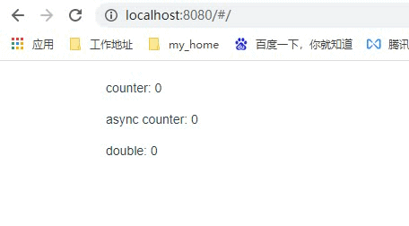

Vuex 是一个专为 Vue.js 应用程序开发的状态管理模式。它采用集中式存储管理应用的所有组件的状态，并以相应的规则保证状态以一种可预测的方式发生变化。

### 整合vuex
Vue cli创建的vue项目中安装：`vue add vuex`

核心概念：
+ state 状态、数据
+ getters 派生状态，类似于计算属性
+ mutations 更改状态的函数
+ actions 异步操作

```
export default new Vuex.Store({
  state: {
    counter: 0
  },
  mutations: {
    add(state) {
      state.counter++
    }
  },
  getters: {
    doubleCounter(state) {
      return state.counter * 2
    }
  },
  actions: {
    add({commit}) {
      setTimeout(() => {
        commit('add')
      }, 1000)
    }
  }
})
```

### 手写简易vuex
___<font size=2 color=green>创建my-vuex.js：Store声明、install实现</font>___
```
let Vue

class Store {
  constructor(options = {}){
    this._vm = new Vue({
      data: {
        state: options.state
      }
    })
  }

  get state() {
    return this._vm._data.state
  }

  set state(v) {
    console.error('不能直接给state赋值!') // 这里通过拦截set属性防止直接赋值
  }
}

function install(_Vue){
  Vue = _Vue

  Vue.mixin({
    beforeCreate() {
      if(this.$options.store) {
        Vue.prototype.$store = this.$options.store
      }
    }
  })
}

export default { Store, install }
```

___<font size=2 color=green>处理getters： getters是store._vm的computed</font>___
```
class Store {
 constructor(options = {}) {
    // 保存用户配置的getters选项
    wrapGetter(this, options.getters || {})
    resetStoreVM(this, options.state || {})
 }
}

function wrapGetter(store, moduleGetter) {
  Object.keys(moduleGetter).forEach(getterKey => {
    const rawGetter = moduleGetter[getterKey]
    // 将options中的getter赋值到_wrappedGetters
    // 因为computed的赋值就是return一个函数
    store._wrappedGetters = {}
    store._wrappedGetters[getterKey] = function wrappedGetter(store) {
      return rawGetter(
        store.state,
        store.getters
      )
    }
  })
}

function resetStoreVM(store, state) {
  store.getters = {}
  // 获取拼接的_wrappedGetters
  const wrappedGetters = store._wrappedGetters
  // 开始拼接computed
  const computed = {}
  Object.keys(wrappedGetters).forEach(key => {
    const fn = wrappedGetters[key]
    computed[key] = () => fn(store)
    Object.defineProperty(store.getters, key, {
      get: () => store._vm[key]
    })
  })
  store._vm = new Vue({
    data: {
      state
    },
    computed
  })
}
```
___<font size=2 color=green>实现commit: 根据用户传入type获取并执行对应mutation</font>___
```
class Store {
  constructor(options = {}) {
    // 保存⽤户配置的mutations选项
    this._mutations = options.mutations || {}

    // 绑定commit上下文否则action中调用commit时可能会出问题！
    // 同时也把action绑定，因为action可以互调
    const store = this
    const {commit, action} = store
    this.commit = function boundCommit(type, payload) {
      commit.call(store, type, payload)
    }
  }
  // 实现commit: 根据用户传入type获取并执行对应mutation
  commit(type, payload) {
    // 获取type对应的mutation
    const entry = this._mutations[type]

    if(!entry) {
      console.error(`unknown mutation type: ${type}`)
      return
    }
    // 指定上下文为Store 传递state给mutation
    entry(this.state, payload)
  }
}
```
___<font size=2 color=green>实现actions：根据⽤户传⼊type获取并执⾏对应action</font>___
```
class Store {
  constructor(options = {}) {
    // 保存⽤户编写的actions选项
    this._actions = options.actions || {}
    // 绑定commit上下⽂否则action中调⽤commit时可能出问题!!
    // 同时也把action绑了，因为action可以互调
    const store = this
    const {commit, action} = store
    this.commit = function boundCommit(type, payload) {
      commit.call(store, type, payload)
    }
    this.action = function boundAction(type, payload) {
      return action.call(store, type, payload)
    }
  }
  dispatch(type, payload) {
    const entry = this._actions[type]

    if(!entry) {
      console.error(`unknown action type: ${type}`)
      return
    }
    // 指定上下文为Store 传递state给mutation
    entry(this, payload)
  }
```
___<font size=2 color=green>更改store/index.js中的vuex引用</font>___
```
// import Vuex from 'vuex'
import Vuex from '../myVuex/my-vuex.js'
```
___<font size=2 color=green>启动项目看效果</font>___

